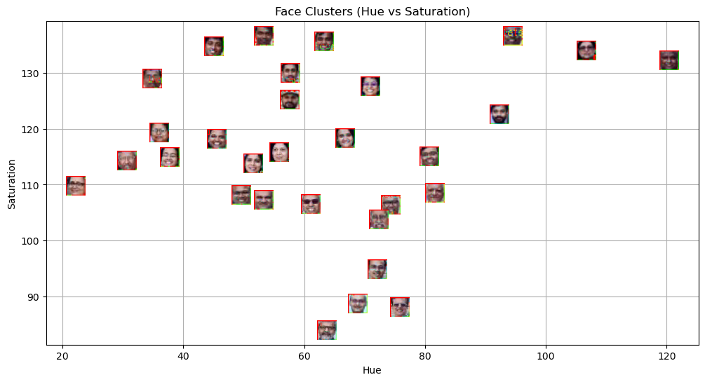
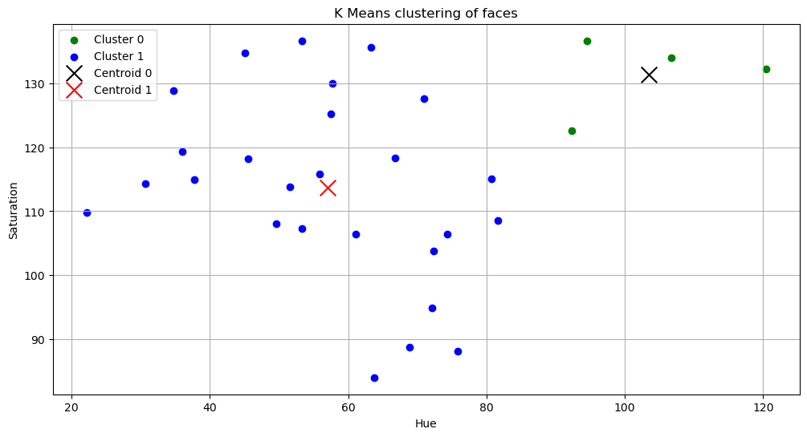
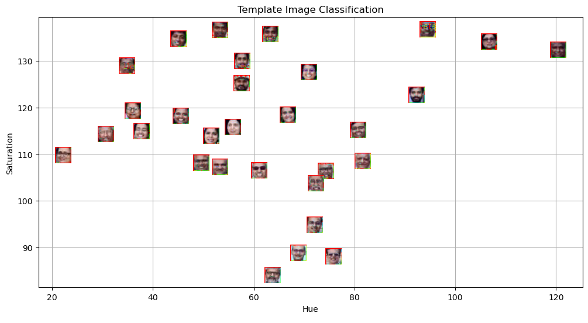
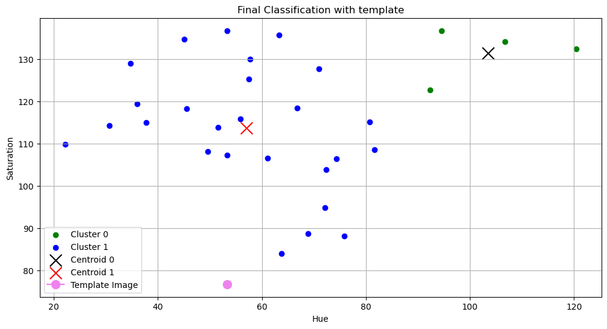

# MLPR Lab 5 Face Detection and Feature Clustering
Author: Kanav Nanda
Course: Machine Learning and Pattern Recognition (Spring Semester 2026)

## Aim and Context
The main goal of this lab was to detect faces in a group photograph, extract specific color features (hue and saturation), and group them using the K Means Clustering algorithm. Finally, I tested the model by passing a new template image to see which group it belonged to.

It is important to note that for this assignment, I was provided with a starter Jupyter notebook containing specific instructions and partial code snippets. My task was to strictly follow these given instructions and fill in the missing blanks to complete the pipeline, without altering the base structure of the provided code.

## Methodology
I broke the project down into four clear steps:

**Step 1: Finding Faces.** I used the Haar Cascade classifier from OpenCV to scan the group photo and draw bounding boxes around the faces.

**Step 2: Extracting Colors.** Regular RGB colors are very sensitive to lighting changes, so I converted the image to the HSV format. I then extracted the average Hue and Saturation for every detected face.

**Step 3: Clustering.** I used the K Means algorithm to split these faces into 2 distinct groups based on their extracted color features. K Means uses distance metrics to assign data points to the nearest cluster.

**Step 4: Testing the Model.** I took a new template image, ran the same face detection, extracted its colors, and asked my trained model to classify it into the closest matching group.

## Key Findings and Visualizations

First, the Haar Cascade tool successfully found 30 faces once I adjusted the scale settings to ignore background noise.

Second, here is what the raw Hue and Saturation data looked like for all the detected faces before applying the grouping algorithm.

Third, plotting the colors showed two neat clusters based on skin tone and lighting differences, complete with their calculated center points.

Fourth, I fed the pipeline a new template image to see if it could detect the face and extract the features properly.

Finally, the model matched the new test image to the correct group based on how close its colors were to the cluster centers. Here is the template plotted against the clusters, followed by the final combined analysis.

## Conclusions
K Means is a very useful algorithm for grouping data when you do not have prior labels. However, the success of distance based algorithms depends entirely on the features you extract. Hue and saturation worked nicely for this specific set of instructions, but for real world applications like emotion classification or face recognition, we would need much more advanced features.

Additionally, picking the right number of groups (the K value) is critical. If K is too high, the model might overfit to the noise, and if it is too low, it might underfit and miss the actual patterns in the data.
